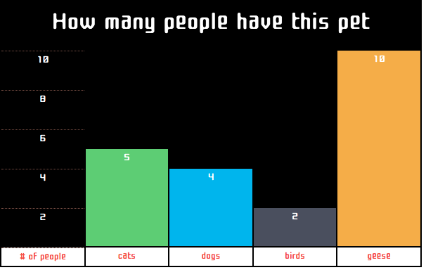
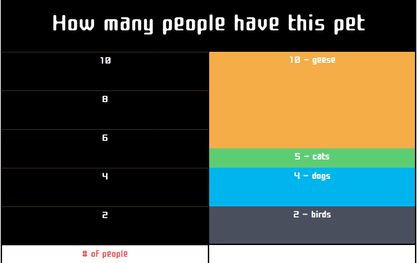
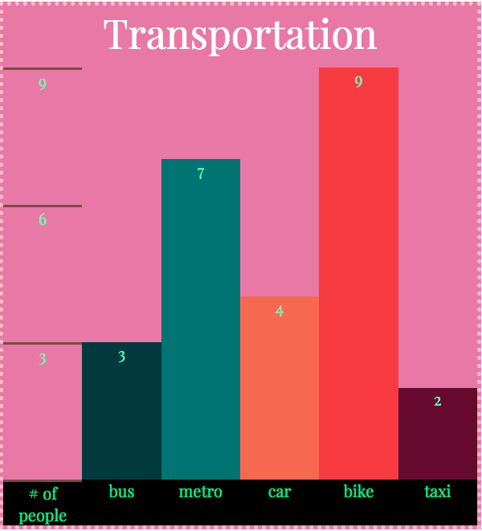
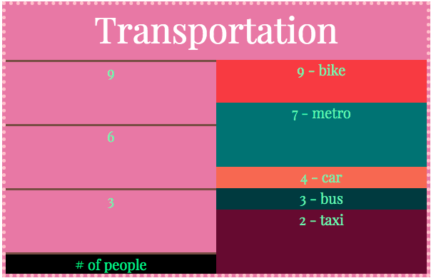

# Bar-graph Generator Program

## <u>About</u>

As part of my web-prep before starting a 12-week coding bootcamp, this project was suggested to be completed before starting classes. It was meant to challeneg what was taught in the prior modules as well as being able to figure out and understand new concepts by doing my own research.

This project was to create an API for a developper to use in order to create custom bar graphs. The user will only need to fill out 3 parameters of a function and then behind the scenes my code will render out a customized bar graph (normal or stacked) to their HTML document. Nearly everything about the graph is created within JavaScript dynamically using DOM.

## <u>Screenshot Examples</u>


 > **Above** A *normal* bar-graph with 4 data values (image 1.1)


 > **Above** A *stacked* bar-graph with 4 data values (image 1.2)



 > **Above** A *normal* bar-graph with 5 data values (image 2.1)


 > **Above** A *stacked* bar-graph with 5 data values (image 2.2)

## <u>How to use the API</u>

The API uses a function in the format of: **drawBarChart(arr, obj, element)**

- Where the *arr* parameter is an array data type and represents the values for each label. Example: For image 1.1 the arr parameter was filled out as [3, 7, 4, 9, 2]. 

- Where the *element* parameter is a string that includes the id of a HTML element in CSS format. **Make sure that the target HTML element doesn't have a BG-Color. Must include "#" in the string. The target HTML element must already exist in your HTML document and have a corresponding id tag.** For example:
```javascript
let element = "#placeChart" 
``` 

- Where the *obj* parameter is an object containing all the styling and customizations of the generated bar graph.

  - *backgroundColor* is to control the BG-Color fo the entire chart. Make sure the target HTML document doesn't have a BG-Color already.
  - *barColorArr* is to control each bar's color individually. It's in an array format which relates to the order of the *arr* parameter.
  - *barNameArr* is an array containing the labels for each bar. It relates to the order of the *arr* parameter.
  - *titleName* is a string that contains the name of the chart.
  - *titleBottomSpace* is to control how much speration from the title and the chart the user wants.
  - *titleFontSize* is to control the font size of the title.
  - *titleFontColor* is to control the text color of the title.
  - *yAxisLabel* is the label that describes what the y-axis values represent in the chart.
  - *yAxisTicksStyle* controls the visual appearence of the y axis ticks. It takes 3 CSS styling parameters in a string format. (width, appearence, color).
    - where *width* is in pixels and describes how tick the line should be.
    - where *appearence* controls the styling of the line. It can be solid, dashed etc.
    - where *color* describes the color. This can be in RBG, RGBA, Hex-code etc.
  - *valueFontColor* controls the color of the y-values on the y-axis as well as on the bars.
  - *yValueStart* is where the first tick on the y-axis should be. If you want the ticks to be evenly spaced out make sure it matches the *yValueStepIncrease* key in the object.
  - *yValueStepIncrease* is how much the ticks increment using the *yValueStart* as the base. Makes sure the highest value in the *arr* parameter is a multiple of this value.
  - *spaceBetweenBars* is how far or close apart the bars will be.
  - *masterWidth* controls how wide the entire chart will be.
  - *masterBorder* is to customize the styling of the chart's border. This will be included within the *masterWidth* key so that the chart will not overflow the width. This is set just like the *yAxisTicksStyle* key.
  - *labelBGColor* controls the background color of the labels for the *barNameArr* key as well as the *yAxisLabel* key.
  - *labelTextColor* controls the text color inside the labels.
  - *fontFamily* is the keywords that describe the font chosen. If the keyword isn't a built-in family keyword use single quotes around the keyword.
  - *fontFamilyURL* If the chosen font is a google font, for example, paste in the href/url for that font. If the font is built-in there is no need for a URL, in which case just type in the font keyword.
  - *stackedBarChart* is a boolean that if:
    - true, the bar chart will be stacked.
    - false, the bar chart will be normal.
  - *masterFontSize* controls the entire chart's font size. 

```javascript
let obj = {
  backgroundColor: "#e378a8",
  barColorArr : ["#013A40", "#027373", "#F26A4B", "#F23D3D", "#630b31"],
  barNameArr : ["bus", "metro", "car", "bike", "taxi"],
  titleName : "Transportation",
  titleBottomSpace : "10px",
  titleFontSize : "50px",
  titleFontColor : "white",
  yAxisLabel : "# of people",
  yAxisTicksStyle : "3px solid rgb(117, 77, 65)",
  valueFontColor: "#79f2a7",
  yValueStart : 3, // for even ticks start should match step increase
  yValuestepIncrease : 3, // make sure that the highest value is a multiple
  spaceBetweenBars : "0px",
  masterWidth: "600px",
  masterBorder: "5px dotted pink",
  labelBGColor: "black",
  labelTextColor: "#36eb7b",
  fontFamily: "'Playfair Display', serif",
  fontFamilyURL: "https://fonts.googleapis.com/css?family=Playfair+Display&display=swap",
  stackedBarChart: true,
  masterFontSize: "20px",
}
```
Side-note: all color styles within the object can accept many forms of color notations such as hex-code (full or short hand), RGB(X, Y, Z), RGBA(X, Y, Z, A) and simple built-in keywords like "black", "white" etc.

## <u>List of known bugs</u>

- With the addition of so many styling options the chart will overflow in height. Some options that create this bug are font sizes and bar height values.

## <u>Upcoming Features</u>

- As of right now, when choosing a stacked bar graph it condenses the data into a single stacked bar. However I would like it to have it accept the data as an array inside an array so that it can render out multiple stacked graphs.

## <u>External Resources That Helped</u>
With the nature of this project forcing me to find my own asnwers, these resources helped me along the way so that I was able to build this program from the ground up.

- Wes Bos CSS grid playlist: https://www.youtube.com/watch?v=Z3BZMd4YzVw&list=PLu8EoSxDXHP5CIFvt9-ze3IngcdAc2xKG&index=3
> It helped me understand how to use the grid system.

- CSS game for flexbox: https://flexboxfroggy.com
> Initially when starting out this project I had decided to use flexbox and this helped me understand how to use the flexbox system. However after some more research I had decided to go with the grid system as it felt like a better choice for this project.

- CSS game for grid: https://cssgridgarden.com
> This game in addition to Wes Bos's playlist really helped me understand the grid system.

- Fundamentals of HTML/CSS: https://www.udemy.com/course/the-web-developer-bootcamp/
> The only paid content in my resources, however without this I would have not been able to even start this project. It taught me how to write HTML, CSS and javascript. From writing functions to selecting HTML elements and everything in-between.

- Lots and lots of google searches
  - MDN
  - W3school
  - past stackOverflow posts with similar questions


  
